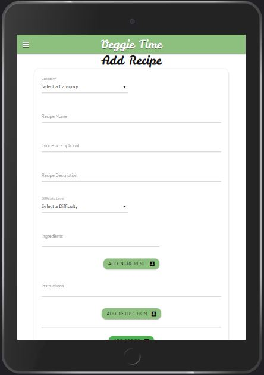

# Veggie Time


### Veggie Time is a website that provides food recipes with a focus on using vegetables. On Veggie Time the user can find, store and create their own recipes. All recipes are organized and displayed on cards, and the user can browse, search and sort through these.
To visit the deployed website, click [here](https://veggie-time.herokuapp.com/).
# Table of Contents
 - <a href="#ux">1. User Experience (UX)</a>
    - <a href="#project-goals">1.1. Project goals</a>
    - <a href="#user-journey">1.2 User Journey</a>
    - <a href="#user-stories">1.2 User stories</a>
    - <a href="#design">1.3 Design</a>
    - <a href="#information-architecture">1.4 Information architecture</a>
    - <a href="#wireframes">1.5 wireframes</a>
- <a href="#features">2. Features</a>
    - <a href="#existing-features">2.1 Existing features</a>
    - <a href="#features-left-to-implement">2.2 Features left to implement</a>
- <a href="#technologies-used">3. Technologies used</a>
    - <a href="#tools">3.1 Tools</a>
    - <a href="#libraries">3.3 Libraries</a>
    - <a href="#languages">3.4 Languages</a>
    - <a href="#frameworks-and-packages">3.4 Frameworks and Packages</a>
- <a href="#testing">4. Testing</a>
- <a href="#deployment">5. Deployment</a>
- <a href="#credits">6. Credits</a>
    - <a href="#contents">6.1 Contents</a>
    - <a href="#media">6.2 Media</a>
    - <a href="#acknowledgements">7. Acknowledgements</a>
- <a href="#disclaimer">8. Disclaimer</a>


# UX

## Project Goals
- To make a web application  that has full CRUD (create, read, update and delete) functionality. 
- To make a full-stack web application using HTML, CSS, JavaScript, Python, MongoDB and the microframework Flask.
- Create a web application that is good looking and easy for users to navigate and use.
- Create a site for users to get inspired to use more vegetables in their own cooking, by browsing or creating their own recipes.
## User Journey
### Home
- When accessing this website, the user will first arrive at the home page. Before scrolling the user can see a navbar/side bar, a hero image, and a vegetable chopper product. The vegetable chopper has a fake link to amazon.com. 


- When the user scrolls past the product section, a search bar, category buttons and recipe cards are displayed. Only six recipes are shown, the user has to click on the link at the bottom in order to see all the recipes. 

 

### Register Page
If the user does not own a user account, the user has to register to get access to all pages and features. This is done by clicking on the "Register" link found in the navbar/sidebar or in the footer. However, if the user already own an account, the user can click the "Log In" link either below the form, in the navbar/sidebar or in the footer. Once on the register page, the user fill in a username and a password, both with requirements mentioned below the input fields. 


### Login Page
The login page looks similar to the register page. If the wrong username or password is submitted, a message will let the user know. BILDE. If the user provides correct information, the user will be directed to the profile page.  

### Profile Page
The user can view their profile when clicking on "My Profile". However, this page will not be accessed if the user is not logged in. 
Once on this page, the user will find an overview of the recipes and favorites the user has created and added. On this page the user can also add and remove to favorites without leaving this page. A flash message will give feedback to the user if adding/removing a recipe.


### All Recipes
When the user clicks on "All Recipes", the page will contain all the recipes, separated by pagination. 


### Viewing a Recipe
When clicking on a recipe card, the user will be directed to a new page, displaying more information about the recipe. On this page there is an arrow that will revert the user back to the home page, and there is a large container that displays all information about the recipe that was chosen. 
Which icons that are being displayed depends on the state of the user. If the user is not logged in, the green heart button will be displayed. If the user is logged in the heart button will either be green if the user has not liked it, or red if the user already likes it. When the user is the author of a recipe, the user will have the ability to delete and/or edit the recipe. 


If the user clicks on the delete button, the user will have to confirm this by clicking "Yes" in a modal that pops up. 
If the user clicks on the edit button, the user will be directed to the editing page.

### Edit Recipe Page
On the edit page, the user will see that all information that is currently used on the recipe is already filled in. Here the user can change and edit what they want. Once the user is finished on this page, the user can either click on the "Save Changes" button if they want, or click the "Cancel" button, which directs the user back to the Home page. 


### Adding a Recipe
When the user is logged in, the user can click on the "Add Recipe" link either in the navbar/sidebar or in the footer. 
The user will be presented with an empty form, where the user can provide information. The user has the option to add an image url link, but this is optional. If no link is added, a default image will be chosen. On both the ingredients and instructions fields, there are buttons for adding extra fields. 
When the user is happy with the information provided, clicking "Add Recipe" will submit the form, creating a new recipe. The user will be directed to the home page, and a flash message will display at the top of the page, saying "Recipe Successfully Added".



## User Stories

The users of this site will be first time visitors and site members.
### First Time Visitor
- As a first time visitor, I want to browse recipes, so that I can easily find recipes I want to read more about.
- As a first time visitor, I want to see images of the meal so that I can see how the dish looks like.
- As a first time visitor, I want to see some sort of rating system, so that I can see what others think about them.
- As a first time visitor, I want to see all the ingredients needed so that I know what is needed in order to make the dish.
- As a first time visitor, I want to see intructions on how to use the ingredients, so that I know how to make the dish.
- As a first time visitor, I want to be able to search for recipes, so that I can search instead of browse for recipes.
- As a first time visitor, I want to know if the dish is easy, medium or hard to make, so that I know the difficulty level of the dish.
- As a first time visitor, I want to know how long it takes to make the dish, so that I can expect how much time I will use.
### Site Members
All the features mentioned for the first time users also applies to the site members.
- As a site member, I want to be able to store recipes, so that I can save the recipes i'm more interested in.
- As a site member, I want to add recipes, so that I can share my own recipes to the site.
- As a site member, I want to be able to edit my recipes, so that I can change it if I want to.
- As a site member, I want to be able to delete my recipes, so that I can remove added recipes if I want to.

## Design
### Colors
There are mainly three colors used on this site, which is pistachio, raisin black and white. Standard Materialize colours (red, green) where used on most buttons. 


- The green pistachio colour is the most used colour. The reason behind this is because vegetables are often assosiated with this color. I also think the standard materialize green colour was better suited for the buttons, and not across the whole site. 
- The black raisin colour is used in the product section, and I think it is a nice contrast to the pistachio color. This color is also used on the login and register button
- The Orange Crayola colour is only used when hovering over areas where the color black raisin is used. These colour go well together and was inspired from this [Free Frontend card](https://codepen.io/fatihtakey/pen/eyyWVr).
- The white color is used throughout the site, and in my opinion works great due to the high contrast against the pistachio and raisin black.
### Fonts
There are used two different fonts on this site: 'Leckerli One' and 'muli'. 
Both of these fonts were found when I was browsing [Free Frontend](https://freefrontend.com/). 
The Leckerli One font was inspired from [this page]( https://codepen.io/tsimenis/pen/xVPLjp). I think this font looks great for my project, and gives a playful image.
The muli font was found from [this page](https://codepen.io/fatihtakey/pen/eyyWVr). This font looked so good I just had to use it. This font is cleaner than Leckerli One, so where that font is not used, I have chosen muli.
Note: Google has renamed the name muli to mulish.

 

## Icons
All icons used on this project is provided by [Font Awesome](https://fontawesome.com/). The icons serves as buttons that has functions, example is the heart button which adds to favorites.
## Images
All images are royalty free and are downloaded from [Pexels](https://pexels.com/), [Unsplash](https://unsplash.com/) and [PurePNG](https://purepng.com/). If users add images to their recipes, they have to copy the image address. This is mentioned in the disclaimer.
## Defensive design
The users can only like recipes when they have registered, and logged in. Once logged in, the user can only edit and delete their own recipes.
When deleting a recipe, the user has to confirm this by  clicking one more time on a pop up modal. 
When adding or editing a recipe, the user is required to enter data in the input fields, and the user can maximum have ten fields of ingredients/instructions. The user also have to provide valid characters.
The user have to make sure the username has between 5-20 characters. The password needs to be at least eight characters, and have at least one letter and one number. If the username and password provided already exists, the user will get a warning about this.
## Interactive Design
- The website is easy to navigate for the user. Below is a overview of how the user can navigate.


## Information Architecture
This project uses MongoDB as a database, and is using four collections. See database structure below:


## Wireframes
To make [wireframes](/wireframes), I used [Balsamiq](https://balsamiq.com/).
# Features
## Existing Features:
Home page:
The home page has a lot of green and a lot of vegetables, quickly giving an impression of what this site contains and is about. A header floating above the background image also greets the user and give a short explanation about the site. Veggie Time is easy to navigate, using navbar/sidebar or links in the footer.
There is a product section in the middle of the home page, with a link to amazon.com. 
Below the product section there is a search bar where the user can search for recipes.
All the recipes have categories and they can be sorted through the category buttons below the search bar.
The home page displays some recipes, and offers the user to view all recipes through a link at the bottom. 
There is a github link at the bottom of the footer.
### Recipes
All recipe cards have a heart button where the user can add and remove favorites, if the user is logged in.
When clicking on a recipe card, the user can delete or edit the recipe if the user is the author. From this page the user can also add/remove favorites.
When viewing a recipe, the user can click on the arrow button on the top left corner to arrive back to the home page. 
### Register, Login and Logout
- Users can create their own account.
- Users can log in and out of the account.
- When the user logs in, a flash message will welcome the user.
-When the user logs out, a flash message will let the user know he/she successfully logged out.
## Features Left to Implement:
- Having the option so select differents serving, so that ingredient will adjust accordingly.
- Have the option to upload images, not just from image adress.
- Adding an email to registration. 
- Adding news/notifications that the user could choose to recieve on their registered mail.
- Adding a field for servings when adding a recipe.
- Improve design. I was really inspired by the cool designs on Free Frontend, so I think it can always get better.
- Adding a superuser/admin with full access that can delete or edit all recipes, so that I don't have to do it through MongoDB.
# Technologies Used
## Tools:
- [Gitpod](https://www.gitpod.io/) used as IDE.
- [GitHub](https://github.com/) used to store and share repository.
- [Git](https://git-scm.com/) for version control.
- [Balsamiq](https://balsamiq.com/) for creating wireframes.
- [dbdiagram](https://dbdiagram.io/) for creating a database diagram of Veggie Time.
- [Lucid](https://lucid.app/) for creating an overview of how the user can navigate the site.
- [Microsoft Paint](https://support.microsoft.com/en-us/windows/get-microsoft-paint-a6b9578c-ed1c-5b09-0699-4ed8115f9aa9) for resizing images.
- [Am I Responsive](http://ami.responsivedesign.is/), a tool that view the site on various devices.
- [CompressJPEG](https://compressjpeg.com/) was used to compress jpg files.
- [PurePNG](https://purepng.com/) was used to download image of vegetable chopper and a broccoli image. 
- [Favicon](https://favicon.io/) was used to create a favicon for this project.

## Libraries:
- [jQuery](https://jquery.com/) a JavaScript library.
- [Materializecss](https://materializecss.com/) for a quick page structure, components and colours.
- [Font Awesome](https://fontawesome.com/) as a provider of icons.
- [Google Fonts](https://fonts.google.com/) as a provider of fonts.

## Languages:

[HTML5](https://en.wikipedia.org/wiki/HTML5),  [CSS3](https://en.wikipedia.org/wiki/CSS), [JavaScript](https://developer.mozilla.org/en-US/docs/Web/JavaScript) and [Python](https://en.wikipedia.org/wiki/Python_(programming_language)).

## Frameworks and Packages
- [Flask](https://flask.palletsprojects.com/en/2.0.x/) is a microframework that was used to provide libraries, technologies and tools for the app.
- [Jinja](https://jinja.palletsprojects.com/en/3.0.x/) was used as a templating language for Python.
- [Werkzeug](https://werkzeug.palletsprojects.com/en/2.0.x/) was used for password hashing, authentication and authorization.
- [Heroku](https://heroku.com/) was used as a platform to deploy the app.
- [MongoDB](https://mongodb.com) was used as a cloud database.


# Testing
The testing of this project can be found as a seperate [TESTING.md](TESTING.md) file.
# Deployment
### Requirements
- Heroku account
-MongoDB account
- Github account
- Python3
### How to clone this project
In order to make a local clone of this project:
1. Log in to Github and go to the repository.
2. Click on the button with the text "Code".
3. Click on the field with the text "Open with Github Desktop".
4. Follow the steps provided by Github Desktop Application or follow the instruction from this [link](https://docs.github.com/en/repositories/creating-and-managing-repositories/cloning-a-repository#cloning-a-repository-to-github-desktop).
## Working with the local copy
Once you have performed the steps above do the following in your IDE:
1. Make sure you install all the requirements in a requirements.txt file. In the terminal window, type: 
```
pip3 install -r requirements.txt.
```
2. Create a MongoDB database.
3. Sign up to your MongoDB account, and create a cluster and a database.
4. Create these four collections in the database: categories, recipes, users and difficulties.
5. Add keys and values for the collections, copy the projects [Information Architecture]() so you get the same keys and values.
6. Create environment variables:
- Create a .gitignore file in the root directory to hide confidential files.
- Create a env.py file that will contain all environment variables
```
    Import os
    os.environ.setdefault("IP", "Added by developer")
    os.environ.setdefault("PORT", "Added by developer")
    os.environ.setdefault("SECRET_KEY", "Added by developer")
    os.environ.setdefault("MONGO_URI", "Added by developer")
    os.environ.setdefault("MONGO_DBNAME", "Added by developer")
```
- Add the env.py file in the .gitignore file.
7. Now run the app. In your terminal window, type:
``` 
python3 app.py.
```
### Heroku Deployment
1. Set up the local workspace for Heroku
- Make sure Heroku know which files to  install by typing the following in your terminal: 

```
pip3 freeze --local > requirements.txt
```
- You also need a Procfile, which is a list of the process types Heroku looks for. Type the following: 
```
python app.py > Procfile
```
2. Sign up to Heroku
-Sign up to Heroku, select your region and create a new app.
3. Deployment using the Github deployment method
- Click on the deploy  tab, and then click on "connect to Github".
- Search for your repository and connect to it.
- Go to the settings tab and click on Reveal Config Vars further down the page.
- Enter the variables that is contained in your env.pr file. Your env.py file should contain the info mentioned above (IP, PORT, SECRET_KEY, MONGO_URI, MONGO_DBNAME).
4. Now you can add, commit and push the Procfile and requirements.txt.
```
    $ git add requirements.txt
    $ git commit -m "Add requirements.txt"

    $ git add Procfile 
    $ git commit -m "Add Procfile"
```
5. Finally, click on the deploy tab in Heroku. Scroll down and click on Automatic Deployments. Choose Enable Automatic Deploys. For manual deployment, see the field "Manual deploy" and click on Deploy Branch.
# Credits
## Contents
[SANwebCORNER](https://www.sanwebcorner.com/2017/02/dynamically-generate-form-fields-using.html) for helping me to create a new field when clicking the add ingredient and add instruction step in add recipes page.
[JorisPaarde's app My Vegan Recipies](https://my-veganrecipes.herokuapp.com/) for how to make flash messages appear for a short while.
[mozillazg](https://gist.github.com/mozillazg/69fb40067ae6d80386e10e105e6803c9) for how to implement pagination on my all recipes page.
## Media
The vegetable chopper is an image downloaded from [PurePNG](https://purepng.com/). A broccoli image was also downloaded from this site, used as a favicon. 
Default recipe image by Engin Akyurt from [Pexels](https://www.pexels.com/photo/flat-lay-photography-of-variety-of-vegetables-1435904/)
Background image of product by Mark Stebnicki from [Pexels](https://www.pexels.com/photo/selective-focus-photo-of-plants-2749165/)
Background image on desktop by Yaroslav Shuraev from [Pexels](https://www.pexels.com/photo/fresh-vegetables-and-fruits-on-the-table-8844888/).
Background image on mobile and tablet by Nadine Primeau from [Unsplash](https://unsplash.com/photos/wpoKpJqOsKE)

## Acknowledgements
My mentor [Precious Ijege](https://www.linkedin.com/in/precious-ijege-908a00168/) for guiding, support and pointing me in the right direction.

The Code Institute [Slack](https://slack.com/) channel for having discussion, questions and answers that contribute to my project. Also a lot of similar projects are posted in the slack channel, which contributed to the planning of my project. 

Thanks to Sean from tutor support. He helped me with the add to favorite function.

[Stack Overflow](https://stackoverflow.com/) for helping me understanding and solving issues along the way.

# Disclaimer

This project is meant for educational purposes only. Please contact me if there are any problems or issues.

- When adding a recipe, the user can choose to insert the image url. These images might not be royalty free.

<a href="#veggie-time">BACK TO TOP</a>
