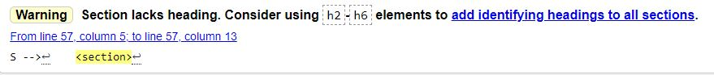
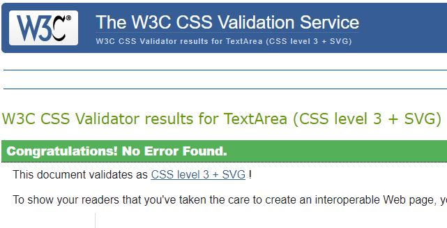
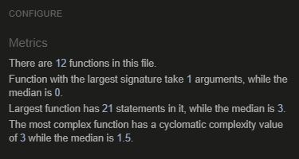
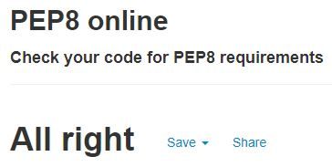
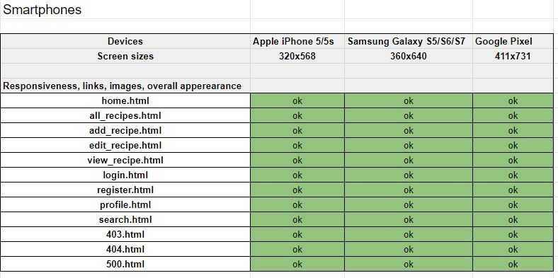
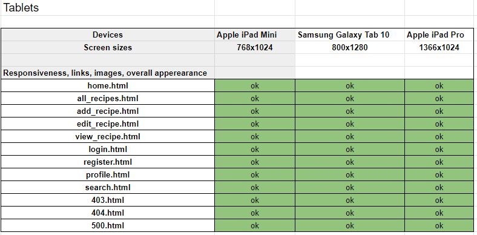
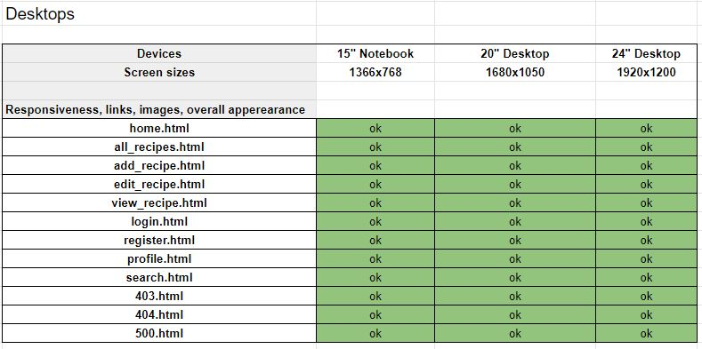

# Table of Contents - Testing
- <a href="#testing-tools">1. Testing Tools</a>
- <a href="#code-validators">2. Code Validators</a>
- <a href="#responsiveness">3. Responsiveness</a>
- <a href="#browser-compatibility">4. Browser Compatibility</a>
- <a href="#user-stories-testing">5. User Stories Testing</a>
- <a href="#defensive-design">6. Defensive Design</a>
- <a href="#bugs">7. Bugs</a>

## Testing tools
- [Google Chrome DevTools](https://developer.chrome.com/docs/devtools/) to view the site in various screen sizes and devices. For trying out style and code without doing any real changes to the page. 
- [Google Lighthouse](https://developers.google.com/web/tools/lighthouse) for testing of performance, accessibility and SEO.
- [W3C CSS Validator](https://jigsaw.w3.org/css-validator/) was used to validate all the css code.
- [W3C Markup Validation Service](https://validator.w3.org/) was used to validate all the html code.
- [JShint](https://jshint.com/) was used to validate the JavaScript code.
- [PEP8](http://pep8online.com/) was used to check validation for all Python code.

## Code Validators

### HTML Validation - No errors

When testing the html code, a warning was frequent on all the test. This is a screenshot of the warning:

This warning is due to the base.html file having jinja templating for viewing flash messages. If there is no message being flashed, this section will be empty. I tried to test this with generating a flash message, and viewing the source code shortly after, and the section was no longer empty. Other than this warning, no errors were found on the html validator.

### CSS Validation - No errors 

### JShint - No errors

### PEP8 - No errors

## Responsiveness

Responsiveness was tested with [Google Chrome DevTools](https://developer.chrome.com/docs/devtools/). Various devices and screen sizes was tested. Note: Throughout the project I have adjusted the screen size in the one of the window corners for a quick responsiveness check. See below for an overview of responsiveness testing:

Testing for smartphones:

Testing for tablets:

Testing for desktops:

## Browser Compatibility

## User Stories Testing

## Defensive Design

## Bugs

