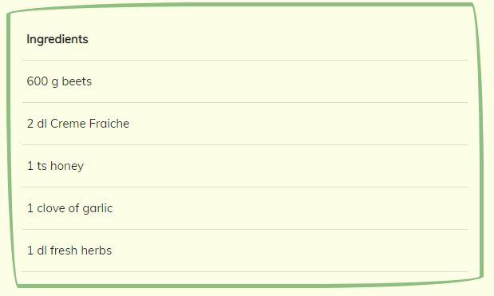

# Table of Contents - Testing
- <a href="#testing-tools">1. Testing Tools</a>
- <a href="#code-validators">2. Code Validators</a>
- <a href="#responsiveness">3. Responsiveness</a>
- <a href="#browser-compatibility">4. Browser Compatibility</a>
- <a href="#user-stories-testing">5. User Stories Testing</a>
- <a href="#defensive-design">6. Defensive Design</a>
- <a href="#bugs">7. Bugs</a>

## Testing tools
- [Google Chrome DevTools](https://developer.chrome.com/docs/devtools/) to view the site in various screen sizes and devices. For trying out style and code without doing any real changes to the page. 
- [Google Lighthouse](https://developers.google.com/web/tools/lighthouse) for testing of performance, accessibility and SEO.
- [W3C CSS Validator](https://jigsaw.w3.org/css-validator/) was used to validate all the css code.
- [W3C Markup Validation Service](https://validator.w3.org/) was used to validate all the html code.
- [JShint](https://jshint.com/) was used to validate the JavaScript code.
- [PEP8](http://pep8online.com/) was used to check validation for all Python code.

## Code Validators

### HTML Validation - No errors

When testing the html code, a warning was frequent on all the test. This is a screenshot of the warning:


This warning is due to the base.html file having jinja templating for viewing flash messages. If there is no message being flashed, this section will be empty. I tried to test this with generating a flash message, and viewing the source code shortly after, and the section was no longer empty. Other than this warning, no errors were found on the html validator.

### CSS Validation - No errors 


### JShint - No errors


### PEP8 - No errors


## Responsiveness

Responsiveness was tested with [Google Chrome DevTools](https://developer.chrome.com/docs/devtools/). Various devices and screen sizes was tested. 
Note: 
- Throughout the project I have adjusted the screen size in the one of the window corners for a quick responsiveness check. 
See below for an overview of responsiveness testing:

Testing for smartphones:


Testing for tablets:


Testing for desktops:


## Browser Compatibility

All browser testing was carried out on various screen sizes to check if responsiveness was okay. 

Results : The floating headline over the hero image on the home page has a slightly blurry background. This is to increase contrast between header and background. The blurry background does not appear on the Mozilla Firefox browser. The backdrop-filter: blur is not supported in Firefox. I don't think this is a major concern as it does not make much difference. See image of the finding:

No blurry background in Firefox:


How it should look:


The difference is very small, but noted in the sheet below:


## User Stories Testing

The users of this site will be first time visitors and site members.
### First Time Visitor
- As a first time visitor, I want to browse recipes, so that I can easily find recipes I want to read more about.
    - As a first time visitor, the user can browse recipes from the home page and all recipes page. Home page is the default page, and recipes will be found at the bottom of the page. There is also a link at the bottom that will redirect the user to the all recipes page. The user can also choose to enter the all recipes page via the navbar/sidebar or the link in the footer.
- As a first time visitor, I want to see images of the meal so that I can see how the dish looks like.
    - As a first time visitor, the user can see that all the recipe cards has images. When clicking on a recipe card, the visitor will see the image enlarged. 
- As a first time visitor, I want to see some sort of rating system, so that I can see what others think about them.
    - As a first time visitor, the user will see a heart icon on all the recipes. This icon will give site members the opportunity to like and add the recipe to favorites. If a recipes has gotten any likes, the first time visitor will see the number of likes next to the heart button. 

        

- As a first time visitor, I want to see all the ingredients needed so that I know what is needed in order to make the dish.
    - As a first time visitor, the user can click on a recipe card to view more information. Once clicked, the user will find all ingredients listed.

        

- As a first time visitor, I want to see intructions on how to use the ingredients, so that I know how to make the dish.
    - As a first time visitor, the user can click on a recipe card to view more information. Once clicked, the user will find all instructions listed.

        

- As a first time visitor, I want to be able to search for recipes, so that I can search instead of browse for recipes.
    - As a first time visitor, the user can find a search bar on the home page and on the all recipes page. 

        

- As a first time visitor, I want to know if the dish is easy, medium or hard to make, so that I know the difficulty level of the dish.
    - As a first time visitor, the user will find information about the difficulty when clicking on a recipe. Once clicked, the difficulty will display without any need for scrolling.

        

### Site Members
All the features mentioned for the first time users also applies to the site members.
- As a site member, I want to be able to store recipes, so that I can save the recipes i'm more interested in.
    - As a site member, the user can store recipes by clicking the heart button that is displayed on all cards. This button/icon will turn red if the user likes it, and revert back to green if the user choose to click it again(remove it from favorites.)

         VS 

- As a site member, I want to add recipes, so that I can share my own recipes to the site.
    - As a site member, the user can add a recipe by clicking "Add Recipe" either from the navbar/sidebar or from the link in the footer.

        
- As a site member, I want to be able to edit my recipes, so that I can change it if I want to.
    - As a site member, the user can edit recipes when the user has clicked a recipe card. Once clicked, an edit icon should appear if the user the author of the recipe.

        
        

- As a site member, I want to be able to delete my recipes, so that I can remove added recipes if I want to.
    - As a site member, the user can delete recipes, when the user has clicked on a recipe card. Once clicked, a delete icon should appear if the user is the author of the recipe.

        
        

## Defensive Design

- The user will only be able to access and view pages like add recipe, edit recipe and my profile if the user is logged in.
    - If the user tries to access a page that is not the user is not authorized to access, it will throw an 403 error:

        
    - If the user tries to access a page that does not exist, it will throw a 404 error:

        

- The user is not able to break the site by clicking on buttons or links. All buttons or links have functions or lead to other places on the site. All external links open in a new tab.

### Register Form:

- When registering, the user has to enter a valid username and password, the requirements is mentioned below the input fields. 
    
    
### Adding a Recipe/Editing a Recipe

- When adding a recipe, the user must enter valid inputs. All important fields are required fields. The user can use spaces, but not start with it, or only input spaces.
    
    Only spaces is not valid:

     
    
    And empty field is not valid: 
    
    

- When adding an image url, it is only optional. If no image is added, a default image will be displayed. However, if the user adds a url, it has to be valid.
I have used this pattern to ensure the user meets some requirements: 
```
pattern="https?://.+"

```

### Deleting a Recipe

- When a user wants to delete a recipe, the user needs to be logged in, and the user have to be the author of the recipe. If the user does not meet these requirements, the page will throw a 403 error.
    - When the user clicks the delete button, they also have to confirm "Yes" in the pop up modal. 
    - The user can actually delete a recipe withouth clicking yes, by copying the id of the recipe, and write in the url "delete_recipe/<id>". This will delete the recipe, but again, only if the user is the author.

## Bugs

- When adding ingredients and instructions, I kept getting invalid input field. The reason was that I had not added a dot as pattern. After including a dot, the issue was fixed.

- The search function gave me the error: "TypeError: object of type 'Cursor' has no len()". To fix the issue i had to add "list(mongo.db.recipes.find())" instead of "mongo.db.recipes.find()" so the function could search through a list.

- I had problems deploying the project to Heroku. After some searching I found out that the issue was that I had the URI in quotes.

- I had problems loading images from the static folder. After searching for a solution, I found [this](https://stackoverflow.com/questions/28207761/where-does-flask-look-for-image-files) from Stack Overflow that helped me. It turned out I was using the wrong syntax.

- I found a really cool product card from [Free Frontend](https://codepen.io/fatihtakey/pen/eyyWVr) that I wanted to use. I added it, and changed it all up and customized it to suit my home page. After I was "done", I realized it looked good on desktop, but horrible on mobile and tablet. I had to spend time I didn't have on customizing it to look good on mobile and tablet. Lesson learned. 


